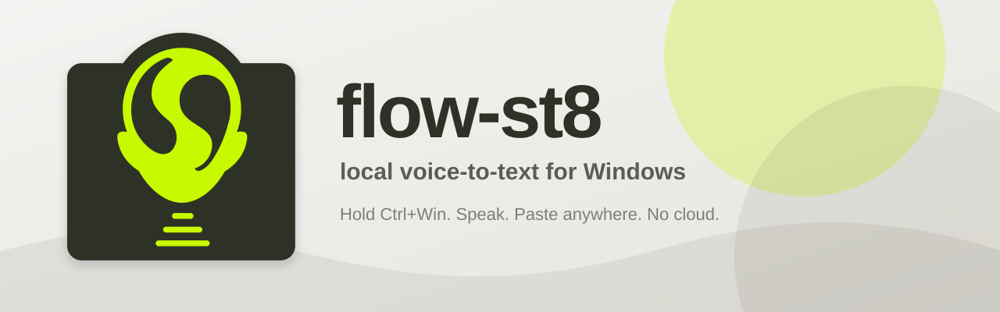

# flow-st8



Local voice-to-text for Windows and macOS. Hold the shortcut to record, release to transcribe, and flow-st8 types your words wherever your cursor is. No cloud, no subscription, no audio leaving your machine.

---

## Highlights

- Local Whisper transcription with GPU acceleration on both platforms — CUDA on Windows, Metal via MLX on Apple Silicon
- Push-to-talk and hands-free toggle hotkeys
- Live recording badge whose dot tracks your voice on a calibrated loudness scale
- System tray menu for model switching, hotkey remapping, autostart, and quit
- Packaged Windows installer and macOS `.app`/`.dmg`
- Privacy-first: audio is processed locally and discarded

---

## Install

**Windows** — download and run the latest `flow-st8-setup.exe` from GitHub Releases.
The setup wizard detects your hardware, installs dependencies, writes config, creates a desktop shortcut, and can enable autostart.

**macOS** — see [macOS](#macos) below. Builds are produced locally for now; drag
`flow-st8.app` from the DMG into Applications.

For development:

```bash
git clone https://github.com/luckmattos/flow-st8.git
cd flow-st8
python install.py
```

---

## macOS

Apple Silicon only. Transcription runs on the GPU through MLX; the same model
on the CPU takes 20-45s per phrase, which reads as a frozen app.

| Hotkey | Behavior |
|---|---|
| Hold `⌃⌥` (Ctrl+Option) | Push-to-talk |
| Press `⌃⌥O` | Toggle: press to start, press again to stop |

Ctrl+Option rather than anything with Cmd: push-to-talk holds the combo for
several seconds while you speak, and every destructive macOS shortcut carries
Cmd — `Ctrl+Cmd+Q` locks the screen.

On first launch macOS will ask for **Accessibility** (to read the global
shortcut and type for you) and **Microphone**. Without Accessibility the app
starts but never reacts to the hotkey, so it reports the missing permission in
the menu bar instead of looking broken.

### Building the DMG

```bash
./packaging/macos/release.sh
```

Produces `dist/flow-st8-<version>-arm64.dmg` (Apple Silicon only).

The script signs with a **self-signed certificate** by default, which costs
nothing and keeps the app's Accessibility permission from being revoked on every
rebuild. Create one once:

```bash
./packaging/macos/make-dev-cert.sh
```

It lands in a dedicated keychain, so no login password is involved and removing
it is one command. Override with `SIGN_IDENTITY=<name>` to use a different one.

### Installing an unsigned build

Builds that are not notarized are blocked by Gatekeeper on first launch. After
dragging the app to Applications, either use System Settings → Privacy &
Security → **Open Anyway**, or clear the quarantine flag directly:

```bash
xattr -dr com.apple.quarantine /Applications/flow-st8.app
```

### Notarized builds

Notarization requires a paid Apple Developer account. With one, store the
credentials once and the same script handles hardened runtime, entitlements,
notarization and stapling:

```bash
xcrun notarytool store-credentials flow-st8-notary \
  --key AuthKey_XXXX.p8 --key-id XXXX --issuer <issuer-id>

SIGN_IDENTITY="Developer ID Application: Name (TEAMID)" \
NOTARY_PROFILE=flow-st8-notary ./packaging/macos/release.sh
```

Nothing else changes — same spec, same bundle, same DMG layout.

---

## Run

Installed users can launch flow-st8 from the desktop shortcut or startup entry.

Development users can run:

```bash
python main.py
```

The app lives in the system tray while it listens for hotkeys.

---

## How To Use

| Windows | macOS | Behavior |
|---|---|---|
| Hold `Ctrl+Win` | Hold `⌃⌥` | Push-to-talk: hold to record, release to transcribe |
| Press `Ctrl+Win+O` | Press `⌃⌥O` | Toggle: press to start, press again to stop |

1. Hold the shortcut; the floating badge appears and reacts to your voice.
2. Talk normally; silence is filtered with VAD.
3. Release; flow-st8 transcribes and types the text.

Tip: press the toggle mid-hold to lock recording in hands-free mode.

Both are remappable from the tray menu.

---

## App vs Installer

| File | Purpose |
|---|---|
| `flow-st8.exe` | The actual background app: hotkeys, recording, transcription, overlay, tray |
| `flow-st8-setup.exe` | The setup wizard: installs/updates files, dependencies, config, shortcuts |

The installer is not the daily app. After setup, run `flow-st8.exe` or the shortcut created by the installer.

---

## Configuration

Config file:

```text
Windows   %APPDATA%\flow-st8\config.toml
macOS     ~/Library/Application Support/flow-st8/config.toml
```

Example:

```toml
[model]
name = "large-v3-turbo"
language = "auto"
initial_prompt = ""

[hotkey]
# Windows defaults; on macOS these are "ctrl+alt" and "ctrl+alt+o".
# "win", "super", "cmd" and "meta" all mean the OS modifier key.
hold_key = "ctrl+win"
toggle_key = "ctrl+win+o"

[audio]
device_index = -1
sample_rate = 16000
channels = 1
chunk_ms = 32
max_seconds = 210
gain = 1.8

[vad]
enabled = true
speech_threshold = 0.5

[startup]
autostart = true
```

---

## Models

| Model | Size | GPU | CPU | Quality |
|---|---:|---:|---:|---|
| `tiny` | 39 MB | ~0.1s | 1-2s | Low |
| `base` | 138 MB | ~0.3s | 3-5s | Decent |
| `small` | 460 MB | ~0.7s | 8-12s | Good |
| `medium` | 1.5 GB | ~1.5s | 25-35s | Very good |
| `large-v3-turbo` | 1.5 GB | ~0.4-1.2s | 20-45s | Excellent |

No GPU? Use `base` or `small` for a practical experience.

---

## Privacy

flow-st8 does not:

- Send audio anywhere
- Capture screenshots
- Require internet after models are downloaded
- Store your recordings

Everything runs locally.

---

## Architecture

A portable core with an OS-specific shell around it:

```text
core/       Portable. Config, paths, recorder, VAD, transcriber, STT backends.
backends/   The shell. Hotkey, injector, overlay, autostart — per platform.
  windows/  Win32 through ctypes
  macos/    AppKit/Quartz through pyobjc
  tray.py   Shared: pystray already abstracts both systems
```

The two shells deliberately share no code — each is written against the
protocols in `backends/base.py` rather than a common abstraction, because the
platform APIs have little in common beyond what they accomplish. The tray is
the one exception: pystray already covers `Shell_NotifyIcon` and
`NSStatusItem`, so duplicating it would mean 170 identical lines.

`import backends` never fails. A platform with no shell gets stubs that raise
only when used, which is what keeps `core/` importable in CI and on machines
that cannot run the OS layer.

---

## Stack

| Layer | Technology |
|---|---|
| Speech-to-text (Windows) | OpenAI Whisper + PyTorch, CUDA when available |
| Speech-to-text (macOS) | MLX Whisper on the Apple GPU |
| Voice detection | Silero VAD |
| Global hotkey | `WH_KEYBOARD_LL` (Windows) · `CGEventTap` (macOS) |
| Audio capture | `sounddevice` |
| Text injection | Clipboard + `SendInput` (Windows) · `CGEventKeyboardSetUnicodeString` (macOS) |
| UI | pystray + Tkinter overlay (Windows) / NSPanel (macOS) |
| Packaging | PyInstaller |

---

## Roadmap

- [x] Packaged Windows app
- [x] Setup wizard
- [x] Live audio overlay
- [x] macOS support (Apple Silicon)
- [ ] Auto-updater
- [ ] Transcription history
- [ ] Per-app custom prompts

---

## Author

[luckmattos](https://github.com/luckmattos). MIT license.
